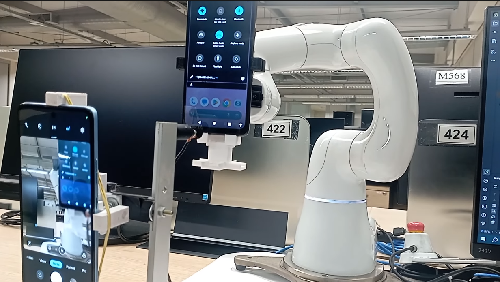

# RFNIT

# Overview

The Robotic Framework for Non-Invasive Testing (RFNIT) is a platform that simplifies testing on smartphones by offering 
an interface that mimics common user gestures and interactions. These actions use image processing to identify elements 
on the smartphone screen and interact effectively.

The \tname{} innovates this methodology by positioning the smartphone on the robot itself and fixing the touch pen 
and camera in a static position on the test bench, as shown in Figure~\ref{robo}. This enables the rotation of the 
device to change the screen orientation, approach NFC cards, and perform complex gestures, such as "chop twice for 
flashlight" and "twist for camera."

We can foresee numerous applications for this infrastructure in the field of software engineering, particularly in the 
context of software testing. A feasible application, in fact, has already been experimented with using a preliminary 
version of this framework: the automatic detection of data loss on Android devices in a non-invasive manner. 

# Architecture

# Functioning
<!-- 

-->

https://github.com/user-attachments/assets/e42c7389-e01f-4bbc-a9e8-e2a2a7cfca38

# How to use
